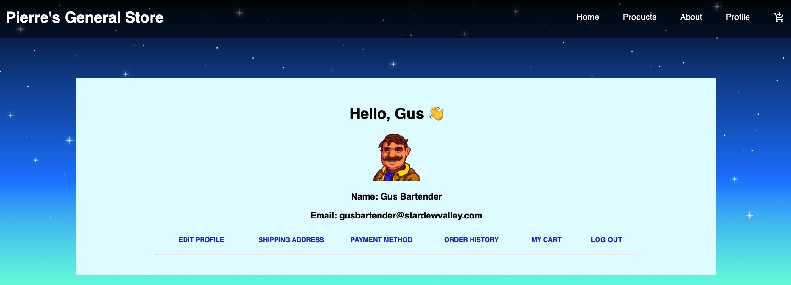

# Welcome To Pierre's General Store
Stardew Valley’s beloved Shop Owner has expanded to the web. 
We’ve created a fullstack e-commerce application.
See the store for yourself at [Pierre’s General Store](https://pierresgeneralstore.herokuapp.com/).


## Setup:
```
git clone git@github.com:2109-Grace-Shopper/eCommerceSite.git
npm install
createdb pierres
npm run seed
npm run start:dev
```

## Tech Stack:
 
#### React: JS library for building user interfaces based on UI components. 

#### Redux: JS library for managing and centralizing application state.
 
#### Material-UI: Allowed us to import and use different components to create a user interface in our React applications.
 
#### Node.js: Open source server environment.
 
#### Express: Back end web application framework for Node.js.
 
#### PostgreSQL: Relational database management system.
 
#### Heroku: Used to deploy, manage, and scale. 


## Screenshots:
Home:


All Products:


Checkout:


User:


## Team: 

### Anshu Patel:
[Github](https://github.com/Litwix)

[LinkedIn](https://www.linkedin.com/in/anshupatel314/)

### Claudia Flores:
[Github](https://github.com/cflores-1)

[LinkedIn](https://www.linkedin.com/in/claudia-f-261691117/)
 
### Emily Roble:
[Github](https://github.com/Evroble)

[LinkedIn](https://www.linkedin.com/in/emily-roble-5a4b5713b/)
 
### Zoe Zhang:
[Github](https://github.com/YizhuoZhang3)

[LinkedIn](https://www.linkedin.com/in/zoe-yizhuo-zhang-73152286/)

